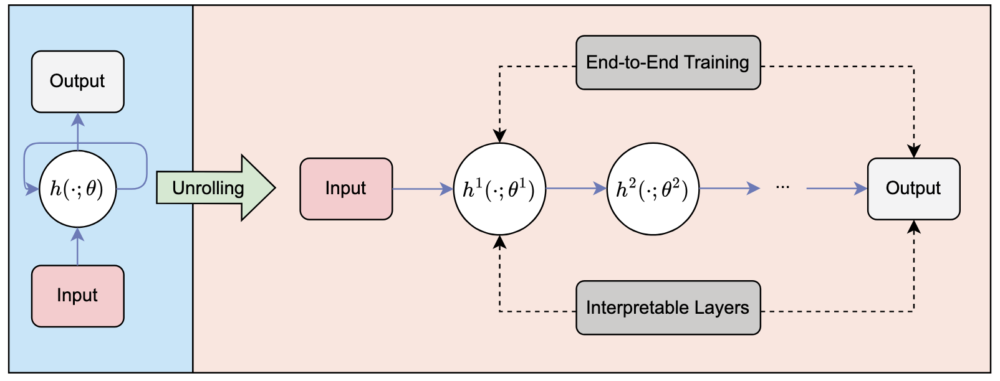

# Porting a Graph Signal Denoising Method to DAGs

This repository contains the implementation and experiment notebook for the bachelor thesis project on extending graph signal denoising from classical undirected settings to directed acyclic graphs (DAGs).

The core artifact is a research notebook that:
- builds graph operators for directed and undirected settings,
- synthesizes smooth graph signals,
- injects controlled noise,
- trains an unrolled iterative denoising model,
- benchmarks operator combinations across multiple spectral complexities.

## Thesis Context

The thesis investigates how the choice of graph difference matrix (operator) affects denoising performance when moving from undirected graphs to DAG-like directed structures.

In particular, it compares:
- directed shift/Laplacian-style operators,
- Möbius-inspired operators based on transitive closure,
- undirected operators obtained via symmetrization,
- incidence-based alternatives.

The evaluation metric is Mean Squared Error (MSE) between clean and reconstructed signals over a broad matrix-pairing sweep.

## Repository Structure

```text
.
├── main.ipynb                 # Main experiment notebook
├── RandomGeoresults.csv             # Result table from random geometric graph experiments
├── RandomGeoResultsEVSorted.csv     # EV-sorted version of result table
├── plots.pdf                        # Exported plots
└── Images/
    ├── Difference Metrices.png      # Operator summary figure
    └── Unrolling.png                # Unrolling architecture figure
```

## Main Notebook

The complete workflow is in:
- `main.ipynb`

The notebook includes:
1. Imports and runtime setup.
2. Noise utilities and data loader creation.
3. A trainable unrolled iterative model (`MyModel`).
4. Random graph generation and connectivity checks.
5. Construction of directed and undirected operator families.
6. Graph signal synthesis from low-eigenvector subspaces.
7. Train/validation/test split and training/evaluation loops.
8. Cross-operator experiment sweep and CSV export.
9. Plotting and publication-oriented visualizations.

## Mathematical Operator Definitions

### Directed Difference Matrices

- Directed shift:
  - $M_{\mathrm{shift}} = I - A$
- Directed Laplacian:
  - $M_{\mathrm{lap}} = D_{\mathrm{in}} - A$
- Normalized directed Laplacian:
  - $M_{\mathrm{norm}} = I - D_{\mathrm{in}}^{-1}A$
- Möbius matrix:
  - $M_{\mathrm{Mob}} = Z^{-1}$, where $Z$ is the transitive-reflexive matrix of $A$
- Möbius Laplacian:
  - $M_{\mathrm{MobLap}} = M_{\mathrm{Mob}} - D_M$
- Modified Möbius matrix:
  - $M_{\mathrm{ModMob}} = M_{\mathrm{Mob}} - \tilde{D}_M$

### Undirected Difference Matrices

With symmetrized adjacency $\overline{A} = A + A^T$:
- Undirected shift:
  - $I - \frac{\overline{A}}{|\lambda_{\max}|}$
- Undirected Laplacian:
  - $\overline{D} - \overline{A}$
- Normalized undirected Laplacian:
  - $I - \overline{D}^{-1/2}\,\overline{A}\,\overline{D}^{-1/2}$
- Left normalized undirected Laplacian:
  - $I - \overline{D}^{-1}\overline{A}$
- Oriented incidence matrix:
  - $B$
- Normalized oriented incidence matrix:
  - $B\overline{D}^{-1/2}$

## Figures

### Difference Matrix Overview


### Unrolling Architecture



## Environment and Dependencies

The notebook imports the following Python packages:
- `torch`
- `pygsp`
- `numpy`
- `pandas`
- `networkx`
- `matplotlib`
- `scikit-learn`

Recommended setup:

```bash
python -m venv .venv
source .venv/bin/activate
pip install --upgrade pip
pip install torch pygsp numpy pandas networkx matplotlib scikit-learn jupyter
```

Then run:

```bash
jupyter notebook main.ipynb
```

## Experimental Protocol (High Level)

1. Generate graph(s) (random geometric and/or Erdos-Renyi variants).
2. Build a dictionary of graph operators.
3. For each eigenvector-count setting:
   - sample smooth clean signals,
   - add Gaussian noise,
   - split into train/val/test.
4. For each signal-operator / train-operator pair:
   - train the unrolled model,
   - infer denoised outputs,
   - compute MSE,
   - append result row.
5. Save results to CSV and render comparison plots.

## Result Files

The CSV outputs use this schema:
- `Eigenvector Count`
- `Signal Matrix Type`
- `Model Matrix Type`
- `MSE`

Examples:
- `RandomGeoresults.csv`
- `RandomGeoResultsEVSorted.csv`

## Notes on Reproducibility

- This project uses stochastic graph generation and randomized signal/noise creation.
- For exact reproducibility, consider adding fixed seeds for:
  - Python `random`,
  - NumPy,
  - PyTorch.
- Runtime can be significant for full cross-operator sweeps.

## Citation

If you use this repository in academic work, please cite the associated bachelor thesis and reference this codebase.

## License

No explicit license file is currently present in the repository.
If you plan to share or reuse this code publicly, consider adding a `LICENSE` file (for example MIT, BSD-3-Clause, or Apache-2.0).
